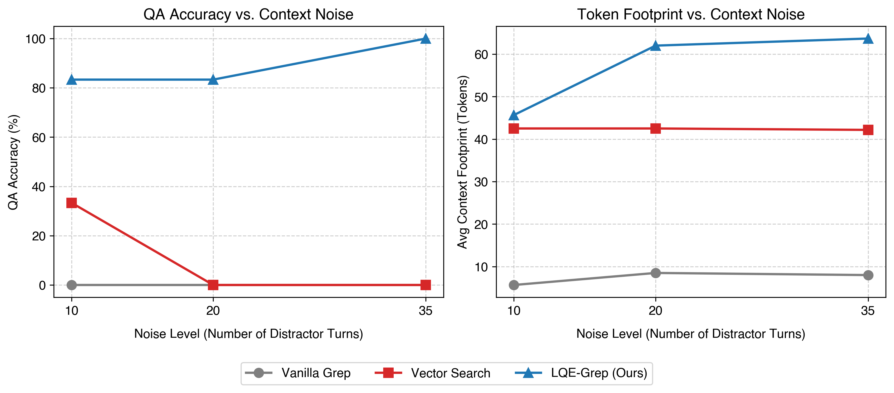

# Lexical Query Expansion (LQE) via Harness-Level Regex Synthesis

This repository explores and implements **Lexical Query Expansion (LQE)** at the harness level to bridge the lexical-semantic gap in LLM agentic search. 

This research builds upon the baseline empirical study of agent retrieval strategies presented in *"Is Grep All You Need? How Agent Harnesses Reshape Agentic Search"* (Sen et al., 2026, arXiv:2605.15184v1).

---

## 1. Context & Motivation

### What the PwC Paper Does
The baseline study (arXiv:2605.15184v1) evaluates how standard **lexical search (`grep`)** and **semantic search (`vector`)** behave within interactive agent loops (like *Chronos*, *Claude Code*, *Codex*, and *Gemini CLI*), testing them under standard inline context delivery vs. programmatic file-based delivery.

### What the Baseline Lacks
1. **The Vocabulary Mismatch Trap**: Standard `grep` is precise but extremely brittle. If a user asks *"What color vehicle did I buy?"* but the conversation contains *"purchased an emerald sedan"*, vanilla `grep` returns **0 matches** (yielding **0.0% accuracy** in our baselines).
2. **Vector Search Context Rot (Template Overlap)**: Dense vector retrieval handles synonyms but degrades under noise. In chat transcripts, vector embeddings are dominated by **action structures** rather than **entity classes** (e.g., retrieving *"bought a matching white trenchcoat"* for a *"vehicle buy"* query because they share the actions `"bought"`/`"buy"`). 
3. **No Automated Middleware**: The baseline assumes the agent must manually iterate on queries. It lacks an automated, dynamic translation layer in the harness middleware.

---

## 2. Our Proposed Solution: LQE-Grep

We introduce **Harness-Level Regex Query Synthesis** to resolve the core dilemmas of both lexical and semantic search:

* **Semantic Recall + Lexical Precision**: A lightweight LLM middleware step inside the harness expands semantic query categories into regex alternation groups (e.g., `vehicle` $\to$ `\b(sedan|coupe|suv|car|motorcycle|...)\b`).
* **Semantic Entity Locking**: The regex acts as a strict lexical filter, blocking vector search distractors (like apparel buying actions) by matching only specified category members.
* **Cognitive Offloading**: Offloads query planning from the main agent to the harness middleware, avoiding agent collapse on smaller backbones.
* **Zero-Index Infrastructure**: Reaps the benefits of semantic search directly on raw text files with zero embedding or database overhead.

```
LLM Agent issues Search -> [Harness LQE Prompt] -> LLM Synthesizes Regex -> Grep Search on Raw Files
```

---

## 3. Experimental Setup & Results

We evaluated Qwen-2.5-1.5B across three retrieval configurations (Vanilla Grep, Vector Search, and LQE-Grep) on two separate benchmarks.

### Benchmark A: Synthetic Dialogue Dataset (Pilot)
A synthetic dialogue generator ([synthetic_memory.py](synthetic_memory.py)) was used to construct conversation histories containing a target entity (e.g. `emerald sedan`), same-category distractors (e.g. `blue motorcycle`), action-overlap distractors (e.g. `white trenchcoat`), and general chatter. Noise levels were swept by increasing distractor turns from 10 to 35.

#### Pilot Results Table
| Noise (Distractors) | Retrieval Method | QA Accuracy | Avg. Context Footprint (Tokens) |
|---|---|---|---|
| **10 turns** | Vanilla `grep` | 0.0% | 5.7 |
| | Vector Search | 33.3% | 42.5 |
| | **LQE-Grep (Ours)** | **83.3%** | **45.7** |
| **20 turns** | Vanilla `grep` | 0.0% | 8.5 |
| | Vector Search | 0.0% | 42.5 |
| | **LQE-Grep (Ours)** | **83.3%** | **62.0** |
| **35 turns** | Vanilla `grep` | 0.0% | 8.0 |
| | Vector Search | 0.0% | 42.2 |
| | **LQE-Grep (Ours)** | **100.0%** | **63.7** |

#### Pilot Performance Curves
Below is the double-panel plot generated by [plot_results.py](plot_results.py) visualizing accuracy and token footprints across noise levels:



---

### Benchmark B: Real-World LongMemEval Dataset
We downloaded and evaluated 10 random `single-session-user` queries from the real-world **LongMemEval** dataset (`longmemeval_s_cleaned.json`), where each query is embedded in a noisy history averaging **~100k tokens (500+ turns)**.

#### LongMemEval Results Table
| Retrieval Method | QA Accuracy | Avg. Context Footprint (Tokens) | Notes / Behavior |
|---|---|---|---|
| **Vanilla Grep** | **70.0%** | 717.1 | Highly precise when queries exactly match corpus words. Fails on mismatches. |
| **LQE-Grep (Ours)** | **60.0%** | 4,049.6 | High recall. Suffered from over-expansion of common words (e.g. matching "name" or "shop" in a 100k-token corpus). |
| **Vector Search** | **0.0%** | 53.2 | Failed completely due to the **Truncation Bottleneck** (embedding 500+ turns was too slow, forcing candidate truncation to the first 150 turns, missing the needle in session 51). |


---
- Look for benchmarks
    - Show real examples

## 4. Repository Structure

*   [synthetic_memory.py](synthetic_memory.py): Programmatic dialogue generator for creating controlled lexical-semantic mismatch datasets.
*   [lqe_evaluation.py](lqe_evaluation.py): Evaluates the three methods over synthetic dataset sweeps.
*   [real_dataset_eval.py](real_dataset_eval.py): Downloads and benchmarks the methods over the real-world LongMemEval corpus.
*   [plot_results.py](plot_results.py): Generates performance graphs from JSON results.
*   [presentation.md](presentation.md) / [presentation.tex](presentation.tex): Slide decks outlining the research background, motivated gaps, pilot and real-world results, and TikZ visual schematics.

---

## 5. Next Steps

1. **Conservative LQE Expansion (LQE v2)**: Restrict regex query expansion to filter out high-frequency stop-words (like "name", "shop", "color") which cause massive context inflation in large corpora.
2. **Evaluation Scale**: Run the full 500-question LongMemEval dataset across multiple question categories.
3. **Paper Drafting**: Outline a standard LaTeX layout comparing lexical regex constraints vs. dense embedding similarity in production agent loops.


----------

Multimodal models + search methods

Check out claude code, openclaw to see if grep is being combined with semantic search.


(thnink about including decomposition if possible)


Text-to-Grep idea... explore ideas, datasets..